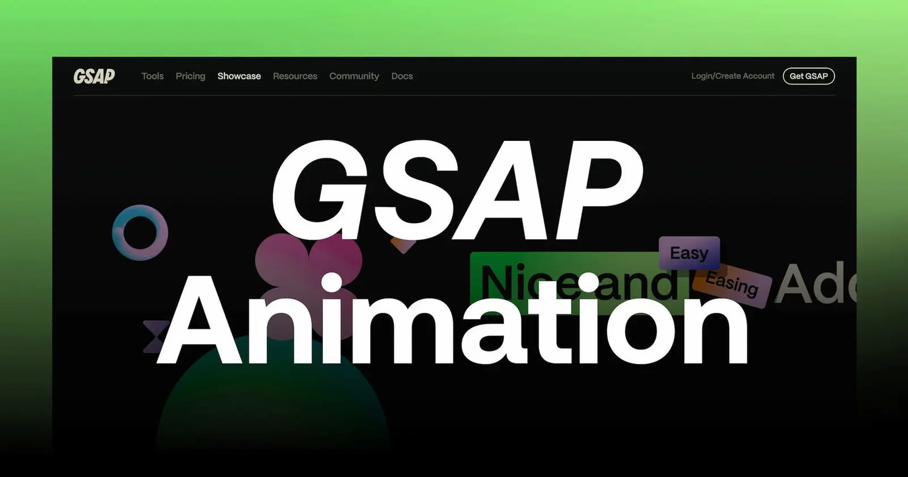

<div align="center">
  <a href="https://gsap-crash-course-eight.vercel.app/" target="_blank">
    
  </a>
  <h3 align="center">✨ GSAP Crash Course Workshop ✨</h3>
  <div align="center">
    
    
    
  </div>
  <br />
  <div align="center">
    A beginner-friendly crash course repo to learn <b>GSAP animations with React</b>.  
    Explore animations like <i>to, from, fromTo, stagger, timelines, and text animations</i> step by step!
  </div>
</div>

---

## 📋 <a name="table">Table of Contents</a>

1. ✨ [Introduction](#introduction)  
2. ⚙️ [Tech Stack](#tech-stack)  
3. 🚀 [Quick Start](#quick-start)  
4. 🔗 [Contacts](#contacts)  
5. ⭐️ [Show Your Support](#support)  

---

## <a name="introduction">✨ Introduction</a>

This project is a **GSAP Workshop** showcasing a variety of primary animations.  
**GSAP (GreenSock Animation Platform)** is one of the most powerful JavaScript animation libraries, used widely to create fluid, performant, and engaging motion experiences across the web.  

By working through this crash course, you’ll learn:  
- The difference between `gsap.to`, `gsap.from`, and `gsap.fromTo`  
- How to chain animations with `timeline`  
- Staggering elements for cool effects  
- Text reveals and smooth transitions  

---

## <a name="tech-stack">⚙️ Tech Stack</a>

- [**React**](https://react.dev/reference/react) is a popular JavaScript library for building user interfaces, particularly single-page applications where data changes over time. React's component-based architecture allows developers to create reusable UI components, making development more efficient and the codebase easier to maintain. 

- [**GSAP**](https://gsap.com/resources/) (GreenSock Animation Platform) is a powerful JavaScript library for creating high-performance animations. It excels in animating HTML elements with smoothness and precision, making it ideal for enhancing user interfaces and web experiences. GSAP's robust API allows developers to create complex animations easily, leveraging timelines and plugins for advanced control and customization. Its efficient rendering engine ensures animations run smoothly across different browsers and devices, providing a seamless user experience.

- [**Vite**](https://vitejs.dev/guide/) is a modern frontend build tool known for fast ES Module imports, efficient bundling, and quick development server startup times. It supports frameworks like Vue.js and React, optimizing workflow and performance compared to traditional bundlers.
  
---

## <a name="quick-start">🚀 Quick Start</a>

Follow these steps to set up the project locally on your machine.

### ✅ Prerequisites
Make sure you have installed:  
- [Git](https://git-scm.com/)
- [Node.js](https://nodejs.org/en)
- [npm](https://www.npmjs.com/) (Node Package Manager)
 

### 📂 Clone the Repository

```bash
git clone https://github.com/Itssanthoshhere/GSAP-Crash-Course.git
cd GSAP-Crash-Course
```

### 📦 Install Dependencies

Let's install the project dependencies, from your terminal, run:

```bash
npm install
```

### ▶️ Run the Project

Installation will take a minute or two, but once that's done, you should be able to run the following command:

```bash
npm run dev
```

Open [`http://localhost:5173`](http://localhost:5173) in your browser to view the project.

---

## <a name="contacts">🔗 Contacts</a>

Let’s connect:

* GitHub: [Itssanthoshhere](https://github.com/Itssanthoshhere)
* LinkedIn: [Santhosh VS](https://www.linkedin.com/in/thesanthoshvs/)

---

## <a name="support">⭐️ Show Your Support</a>

If this repo helped you, please give it a ⭐ and share it with others!

